# 📊 Superstore Sales Data Analysis

An Exploratory Data Analysis (EDA) project on the Sample Superstore dataset using **Python**, **Pandas**, **Matplotlib**, and **Seaborn**. This project focuses on cleaning the data, analyzing sales performance, and generating meaningful visualizations to uncover business insights.

---

## 📌 Project Overview

The objective of this project is to analyze the Superstore sales dataset to identify trends, customer behavior, and business performance. The analysis includes data preprocessing, feature engineering, KPI calculation, and visual exploration.

---

## 🚀 Features

- Data loading and preprocessing
- Missing value and duplicate detection
- Date conversion and feature engineering
- Sales, Profit, Orders, and Customer KPIs
- Sales analysis by Category
- Profit analysis by Category
- Top 10 Products by Sales
- Top 10 States by Sales
- Monthly Sales Trend
- Yearly Sales Trend
- Customer Segment Analysis
- Discount vs Profit Analysis
- Correlation Heatmap
- Profit Distribution
- Top Customers by Sales
- Loss-making Sub-Categories
- Sales by Shipping Mode
- Export cleaned dataset

---

## 📂 Dataset

**Dataset:** Sample Superstore Dataset

The dataset contains information about:
- Orders
- Customers
- Products
- Sales
- Profit
- Discounts
- Shipping Details

---

## 🛠️ Technologies Used

- Python
- Pandas
- NumPy
- Matplotlib
- Seaborn

---

## 📊 Visualizations

The project includes the following visualizations:

- Sales by Category
- Profit by Category
- Top 10 Products by Sales
- Top 10 States by Sales
- Monthly Sales Trend
- Yearly Sales Trend
- Sales Contribution by Segment
- Discount vs Profit Scatter Plot
- Correlation Heatmap
- Profit Distribution
- Top Customers by Sales
- Sales by Ship Mode

---
## 📷 Project Output

### 📊 Sales by Category

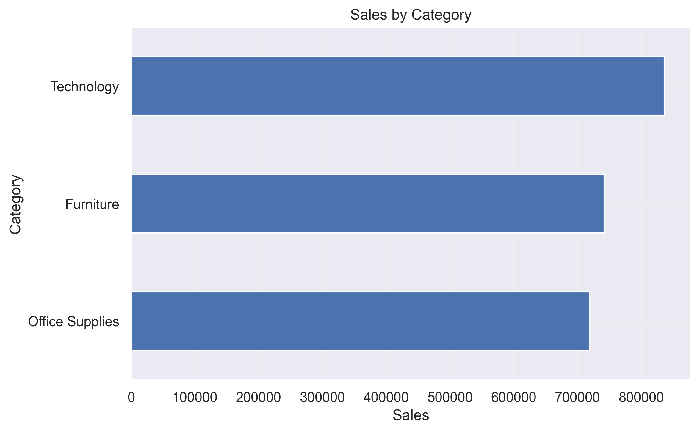

---

### 💰 Profit by Category

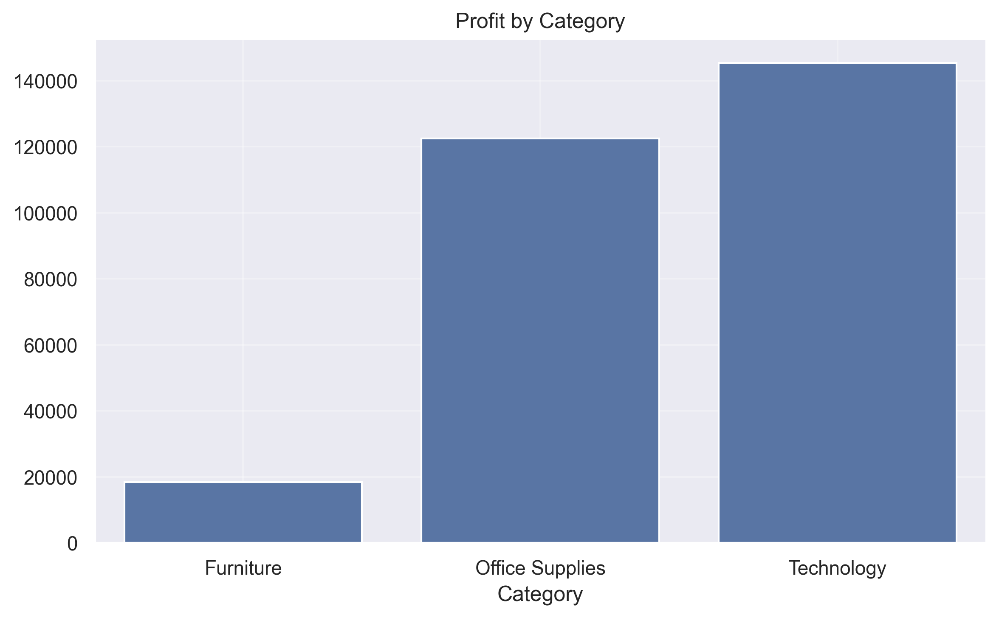

---

### 🏆 Top 10 Products by Sales

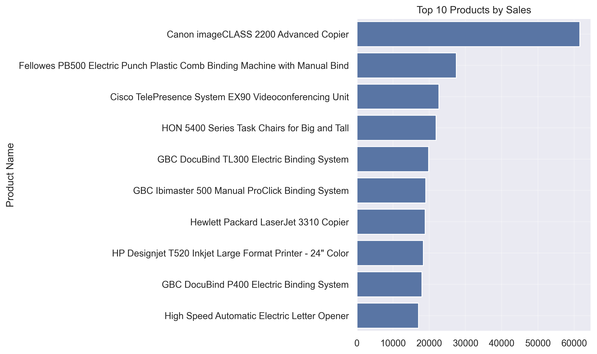

---

### 🌍 Top 10 States by Sales

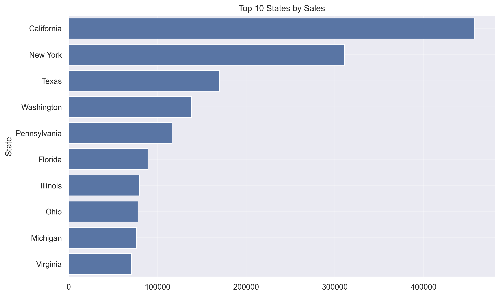

---

### 📈 Monthly Sales Trend

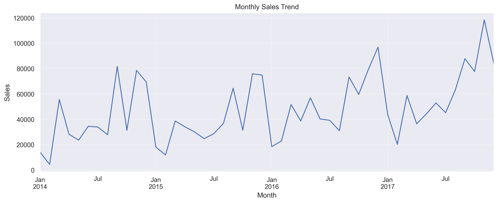

---

### 📅 Yearly Sales Trend

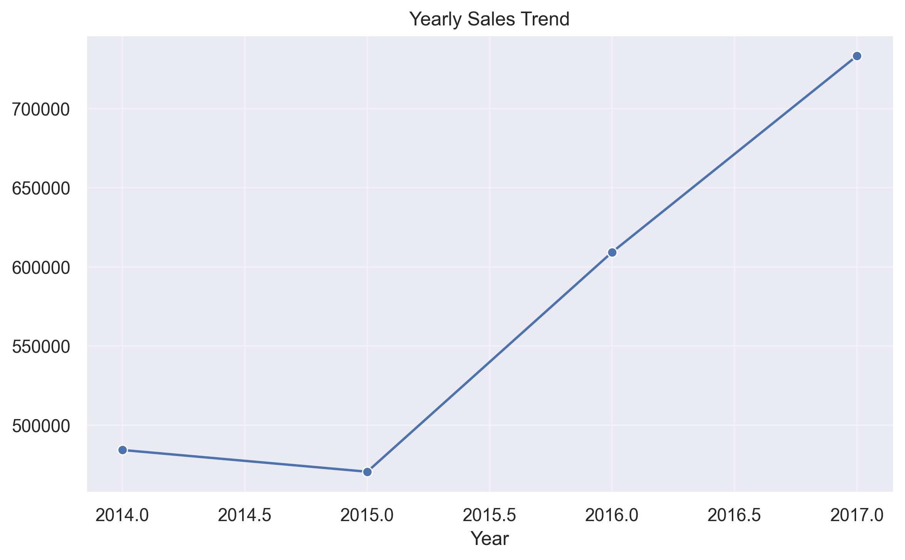

---

### 🥧 Sales Contribution by Segment

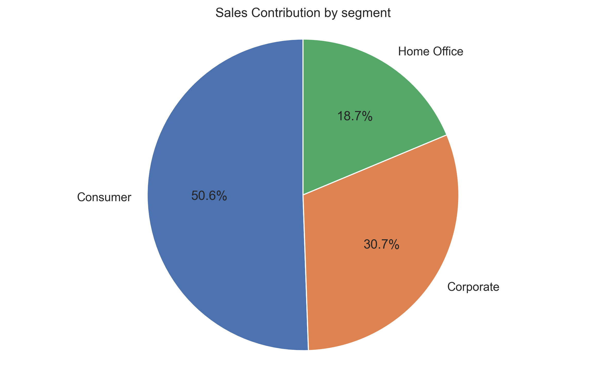

---

### 📉 Discount vs Profit

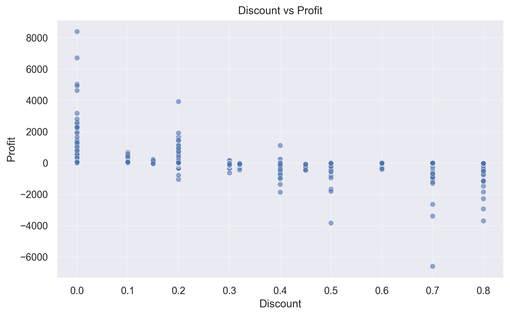

---

### 🔥 Correlation Heatmap

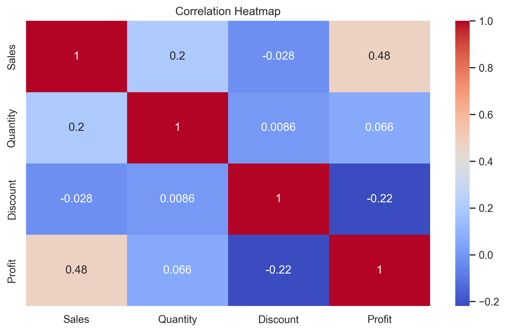

---

### 📊 Profit Distribution

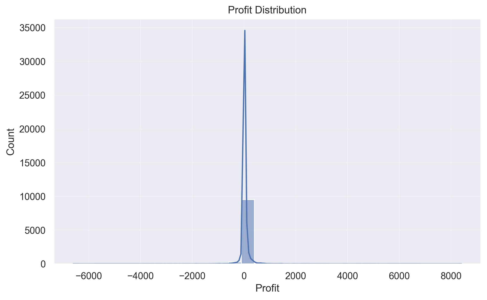

---

### 👥 Top Customers by Sales

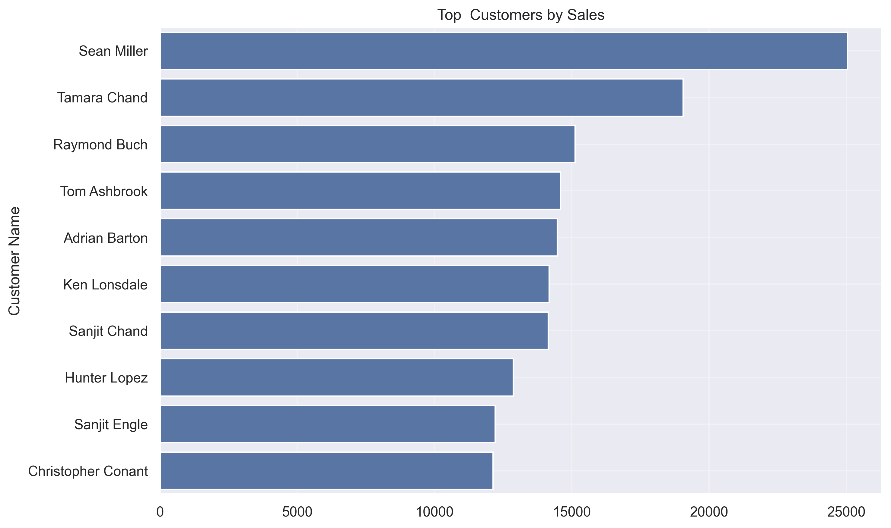

---

### 🚚 Sales by Ship Mode

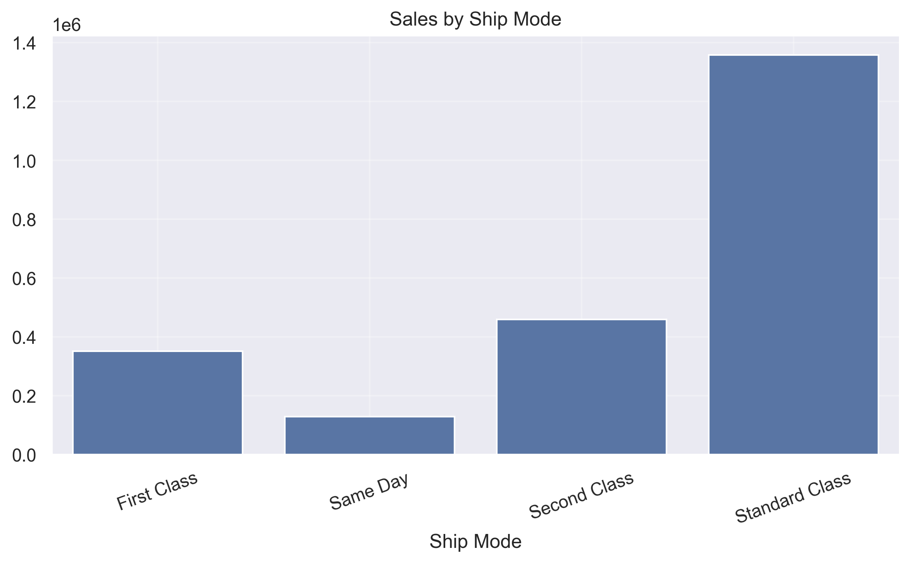

---

## 📈 Key Insights

- Identifies the highest-performing product categories.
- Highlights top-selling products and states.
- Tracks monthly and yearly sales performance.
- Examines the impact of discounts on profitability.
- Identifies high-value customers.
- Detects loss-making sub-categories.
- Provides business insights through interactive visualizations.

---

## 📁 Project Structure

```
Sales-Data-Analysis/
│
├── Sample - Superstore.csv
├── cleaned_superstore.csv
├── SalesDataAnalysis.py
├── README.md
└── charts/
    ├── Sales_by_Category.png
    ├── Profit_by_Category.png
    ├── Top_10_Products.png
    ├── Top_10_States.png
    ├── Monthly_Sales_Trend.png
    ├── Yearly_Sales_Trend.png
    ├── Sales_by_Segment.png
    ├── Discount_vs_Profit.png
    ├── Correlation_Heatmap.png
    ├── Profit_Distribution.png
    ├── Top_Customers.png
    └── Sales_by_Ship_Mode.png
```

---

## ▶️ How to Run

1. Clone the repository

```bash
git clone https://github.com/snehaofficial-10/Superstore-Sales-EDA.git
```

2. Navigate to the project folder

```bash
cd Superstore-Sales-EDA
```

3. Install the required libraries

```bash
pip install pandas numpy matplotlib seaborn
```

4. Run the Python script

```bash
python SalesDataAnalysis.py
```

---

## 📌 Future Improvements

- Interactive dashboard using Streamlit or Power BI
- Sales forecasting using Machine Learning
- SQL database integration
- Advanced customer segmentation
- Automated reporting

---


GitHub: https://github.com/snehaunoffical888-hash/Superstore-Sales-EDA.git


## 👨‍💻 Author

**Sneha Vinod Pandey**
**Bachelor of Science in Information Technology**
**Aspiring Data Engineer**


